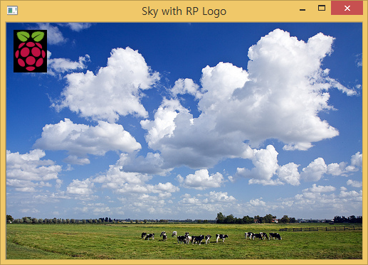
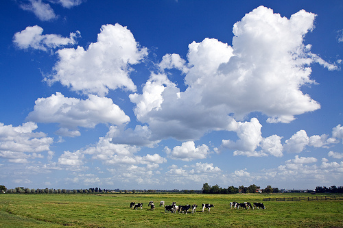
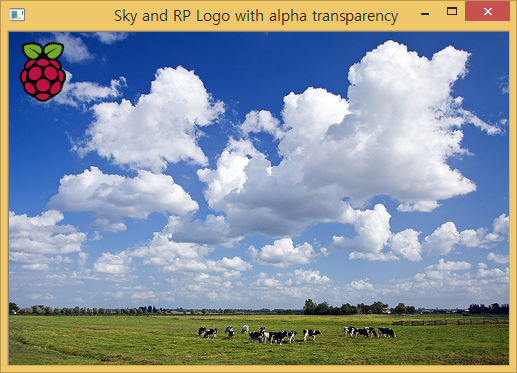

서로 다른 두가지 이미지를 가지고 이를 결합하여 새로운 이미지를 만드는 과정을 설명한다.

1. 두 이미지를 다운로드 받아 로컬컴퓨터에 저장한다.
1. 배경 이미지(큰 이미지)와 앞에 강조될 이미지(작은 이미지) 정보를 확인한다.
    * 작은 이미지 크기를 작게 축소한다. 
1. 작은 이미지를 큰 이미지 행렬에 오프셋을 두고 해당 크기만큼 치환한다.

## 1. 결합할 이미지 대상

이미지넷에서 검색한 [하늘 이미지](http://farm3.static.flickr.com/2605/3865434892_257e8067d7.jpg)와 구글 이미지 검색에서 [라즈베리 파이 로고](https://upload.wikimedia.org/wikipedia/en/c/cb/Raspberry_Pi_Logo.svg) 두가지 이미지를 다운로드 받아 로컬 컴퓨터에 저장한다.

| 큰 이미지 | 작은 이미지 |
|------------------------------|------------------------------|
|  |

## 2. 두 이미지 정보 확인

`sky.jpg` 이미지와 `raspberry-pi-logo.png` 이미지 크기를 살펴보면 
배경 하늘 이미지보다 로고 이미지가 훨씬 더 큰 것을 확인할 수 있다.
따라서 이를 축소할 필요가 있다.

~~~ {.output}
===== Original Image Info =====
Sky Image :  (333, 500, 3)
RP Image  :  (599, 474, 3)
~~~

## 3. 로고 이미지 축소

로고 이미지를 $\frac {1}{10}$ 비율로 축소한다. 축소된 이미지 정보는 다음과 같다.

~~~ {.output}
===== Resized RP Logo Image Info =====
RP Image  :  (60, 47, 3)
~~~

## 4. 이미지 합치기

다양한 방법이 있지만, 배경하늘 이미지도 큰 행렬로 큰 행렬 특정 위치에 로고 이미지를 치환하여 두 이미지를 합치는 전략을 취한다.
먼저 오프셋을 두고 `x`, `y` 방향으로 10만큼 두고 이미지 크기에 해당되는 부분에 자리를 로고 이미지로 치환한다.

## 5. 전체 코드 

~~~ {.python}
import cv2

skyImg = cv2.imread('../fig/sky.jpg',1)
rplogoImg = cv2.imread('../fig/raspberry-pi-logo.png',1)

## Image info
print '===== Original Image Info ====='
print 'Sky Image : ', skyImg.shape
print 'RP Image  : ', rplogoImg.shape

## Image Resize
rplogoImgDownscale = cv2.resize(rplogoImg, None,
                                fx=0.1, fy=0.1, interpolation=cv2.INTER_AREA)

print '===== Resized RP Logo Image Info ====='
print 'RP Image  : ', rplogoImgDownscale.shape

## Image Addition
x_offset = y_offset = 10
skyImg[y_offset:y_offset + rplogoImgDownscale.shape[0],
       x_offset:x_offset + rplogoImgDownscale.shape[1]] = rplogoImgDownscale

## Result
cv2.imshow('Sky with RP Logo', skyImg)
cv2.waitKey(0)

cv2.destroyAllWindows()
~~~

## 6. 하나 더 [^stackoverflow-add-images]

[^stackoverflow-add-images]: [overlay a smaller image on a larger image python OpenCv](http://stackoverflow.com/questions/14063070/overlay-a-smaller-image-on-a-larger-image-python-opencv) 

알파채널을 이용하여 위에서 나온 검정색 사각형 부분을 제거하고, 두 이미지를 결합하는 코드

~~~ {.python}
import cv2

skyImg = cv2.imread('../fig/sky.jpg', -1)
rplogoImg = cv2.imread('../fig/raspberry-pi-logo.png', -1)

## Image info
print '===== Original Image Info ====='
print 'Sky Image : ', skyImg.shape
print 'RP Image  : ', rplogoImg.shape

## Image Resize
rp = cv2.resize(rplogoImg, None, fx=0.1, fy=0.1, interpolation=cv2.INTER_AREA)
                                
print '===== Resized RP Logo Image Info ====='
print 'RP Image  : ', rp.shape

## Image Addtion with Alpha
x_offset = y_offset = 10
for c in range(0,3):
    skyImg[y_offset:y_offset+rp.shape[0], x_offset:x_offset+rp.shape[1], c] = \
    rp[:,:,c] * (rp[:,:,3]/255.0) + \
    skyImg[y_offset:y_offset+rp.shape[0], x_offset:x_offset+rp.shape[1], c] * (1.0 - rp[:,:,3]/255.0)
    
## Result
cv2.imshow('Sky and RP Logo with alpha transparency ', skyImg)
cv2.waitKey(0)

cv2.destroyAllWindows()
~~~