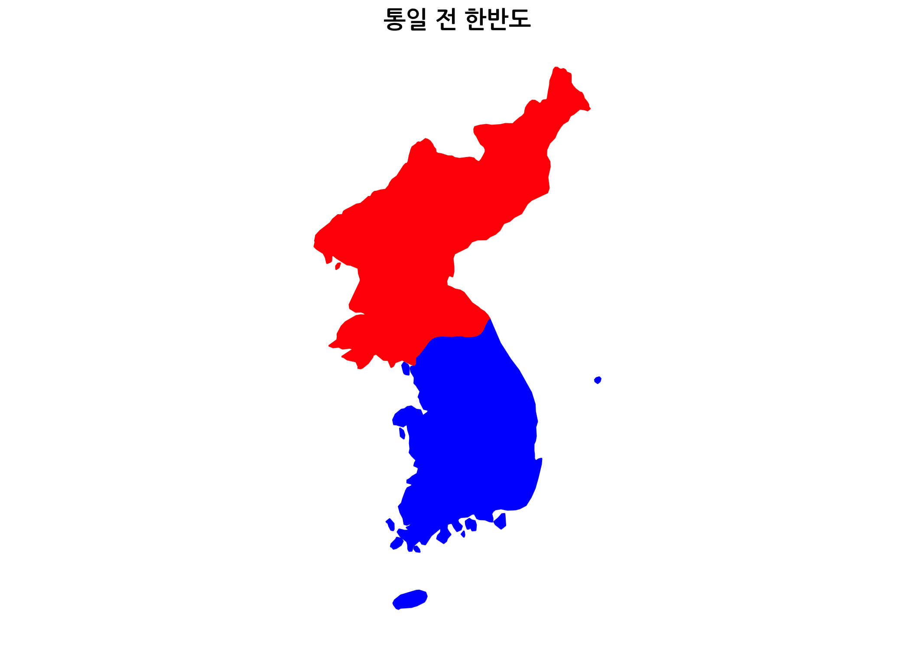

``` {r, include=FALSE}
source("tools/chunk-options.R")
knitr::opts_chunk$set(echo = TRUE, warning=FALSE, message=FALSE)

windowsFonts(
  nanum=windowsFont("NanumGothic")
)
options(scipen = 999)
options(dplyr.width = 120)
options(dplyr.print_max = 1e9)

dev.off <- function(){
  invisible(grDevices::dev.off())
}
```

# 고급 이미지 처리 [^image-magick] [^ropensci-call] {#image-magick}

[^image-magick]: [The magick package: Advanced Image-Processing in R (2018-05-11)](https://cran.r-project.org/web/packages/magick/vignettes/intro.html)

[^ropensci-call]: [Jeroen Ooms talks about magick - R bindings to ImageMagick](https://vimeo.com/channels/rocommunitycalls/180799058)

[magick](https://cran.r-project.org/web/packages/magick/index.html) 팩키지를 통해서 가장 널리 사용되는 
`Magick++ STL` 통해서 다양하고 풍부한 이미지 처리를 R에서 가능하다.


# 단일 이미지 {#single-image}

단일 이미지로 가장 많이 사용하는 것이 잘라내고 크기를 조정하고 색을 채워넣는 등이 포함된다.

- image_crop(image, "100x150+50"): 왼쪽으로부터 50px 떨어져 가로 100px, 세로 150px 크기로 이미지를 잘라낸다.
- image_scale(image, "200"): 가로폭이 200px 크기로 비례하여 이미지 크기를 재조정한다.
- image_scale(image, "x200"): 세로폭이 200px 크기로 비례하여 이미지 크기를 재조정한다.
- image_fill(image, "blue", "+100+200"): x:100, y:200 위치에서 시작하여 푸른색을 채워넣음.
- image_border(frink, "red", "20x10"): 좌우 20px, 상하 10px 크기로 액자형태로 붉은색을 넣음.

``` {r image-magick-basic}
# 0. 환경설정 ------
library(magick)
library(tidyverse)
library(tidygraph)
library(particles)
library(animation)
library(magick)

# 1. 이미지 크기조정 ------
suji <- image_read("fig/architecture_101.PNG")

suji_crop <- image_read("fig/architecture_101.PNG") %>% 
  image_crop("500x350+200+200") %>% 
  image_scale("300")

suji_resize <- image_read("fig/architecture_101.PNG") %>% 
  image_scale("300")

suji_border <- image_read("fig/architecture_101.PNG") %>% 
  image_border("green", "20x10")

suji_img <- c(suji, suji_crop, suji_resize, suji_border)

image_scale(suji_img, "300x300") %>% 
  image_append()
```

# 다수 이미지 {#multiple-image}

다수 이미지를 불러 읽어온다. 그리고 나서 
이미지를 `c()` 연산자로 벡터로 묶어낸다. 이미지 크기가 다르기 때문에 적절한 크기로 이미지크기를 재조정한다: `300x300`. `image_info()` 함수로 각 이미지에 대한 정보 확인이 가능하다.

- `image_mosaic(imgs)`: `image_mosaic()` 함수는 이미지를 차곡차곡 올리고자 할 때 사용한다.
- `image_flatten(imgs)`: `image_flatten()` 함수는 첫번째 이미지 크기에 기반하여 각 이미지를 레이어로 보고 한장에 올린다.
- `image_flatten(imgs, 'Add')`: RGB 색상으로 덧셈
- `image_flatten(imgs, 'Modulate')`: RGB 색상으로 나머지 연산
- `image_flatten(imgs, 'Minus')`: RGB 색상으로 뺄셈

혹은, `image_append()` 함수를 사용해서 이미지를 가로 혹은 세로로 쭉 쌓을 수 있다.


``` {r multiple-images}
# 3. 다수 이미지 -----
## 3.1. 이미지 가져오기
suji <- image_read("fig/architecture_101.PNG")
rpi <- image_read("fig/raspberrypi-logo.png")
bigdata <- image_read('https://jeroen.github.io/images/bigdata.jpg')
rlogo <- image_read("https://jeroen.github.io/images/Rlogo.png")

## 3.2. 이미지 결합
imgs <- c(suji, rpi, bigdata, rlogo)
imgs <- image_scale(imgs, "300x300")
image_info(imgs)

## 3.3. 이미지 계층 결합방식
imgs_mosaic <- image_mosaic(imgs)
imgs_flatten <- image_flatten(imgs)
imgs_add <- image_flatten(imgs, 'Add')
imgs_modulate <- image_flatten(imgs, 'Modulate')
imgs_minus <- image_flatten(imgs, 'Minus')

image_scale(c(imgs_mosaic, imgs_flatten, imgs_add, imgs_modulate, imgs_minus), "300x300") %>% 
  image_append()

## 3.4. 이미지 결합
### 가로 방식
imgs %>% 
  image_scale("x200") %>% 
  image_append()
### 세로 쌓기 방식
imgs %>% 
  image_scale("x100") %>% 
  image_append(stack=TRUE)
```

# 애니메이션 {#image-animation}

## 대한민국 {#image-animation-korea}

이미지를 레이어로 처리하는 대신 시간을 넣은 개념으로 처리하게 되면 애니메이션을 만들 수 있다. 즉, 각 이미지가 **레이어(layer)** 대신에 **프레임(frame)**으로 활용한다.

`image_animate()` 함수를 사용해서 애니메이션도 가능하고 `image_morph()`를 사용해서 중간 프레임 갯수를 지정하면 두 이미지 변화기간 동안 애니메이션 효과를 낼 수 있다.

<div class = "row">
  <div class = "col-md-6">

``` {r two-korea-fps}
# 1. 애니메이션 이미지 -----
## 1.1. 이미지 가져오기
koreas <- image_read("fig/two-korea.png")
korea <- image_read("fig/one-korea.png")

image_animate(c(koreas, korea), fps = 0.5, dispose = "previous")
```

  </div>
  <div class = "col-md-6">
``` {r two-korea-morph, eval=FALSE}
korea_frames <- image_morph(c(koreas, korea), frames = 20)
korea_ani <- image_animate(korea_frames)
image_write(korea_ani, "korea_ani.gif")
```


  </div>
</div>

## 수지와 라이언 {#image-animation-suji-lion}

[라이언(카카오프렌즈)](https://namu.wiki/w/%EB%9D%BC%EC%9D%B4%EC%96%B8(%EC%B9%B4%EC%B9%B4%EC%98%A4%ED%94%84%EB%A0%8C%EC%A6%88))의 `.gif` 이미지를 받아서 건축학 개론 포스터를 배경이미지로 활용한다. 

이때 중요한 것이 배경이미지를 `image_composite()` 함수를 사용해서 결합시키는 것이다.
다음으로 애니메이션을 만드는 방법은 앞서 `image_animate()` 함수에 `fps = 20`인수를 넣어 초당 프레임수를 지정하면 간단히 애니메이션을 제작할 수 있다.


``` {r ryan-suji}
# 2. 애니메이션 결합: 배경 이미지와 애니메이션 결합 - 첫번째
### 라이언 지정
ryan <- image_read("fig/ryan.gif") %>% 
  image_scale("100x100")

### 배경지정
background <- image_read("fig/architecture_101.PNG") %>% 
  image_scale("300x")

### 배경과 결합
ryan_frames <- image_composite(background, ryan, offset = "+60+200")

### 애니메이션
ryan_ani <- image_animate(ryan_frames, fps = 20)
print(ryan_ani)
```

# 이미지와 그래프 {#image-graph}

## 정적이미지 {#image-graph-static}

이미지와 그래프를 함께 구현하는 것도 많은 데이터 과학자의 오랜 희망이었으나, 과거 기술적으로 가능했으나 여러가지 장애요소가 있었지만, `magick` 팩키지에서 나름 수월하게 사용할 수 있는 방식을 제시하고 있다.

1. 그래프 캔버스를 준비한다.
2. `ggplot`을 그리고 나서 `dev.off()`로 마무리한다.
3. `image_composite()` 함수를 사용해서 `ggplot`과 이미지를 결합시킨다.

``` {r image-graph}
smpl_fig <- image_graph(res = 96)
ggplot(mtcars, aes(x=wt, y=mpg, color=cyl)) +
  geom_point()
dev.off()

rlogo <- image_read("https://www.r-project.org/logo/Rlogo.png")
mpg_gg <- image_composite(smpl_fig, image_scale(rlogo, "x150"), offset = "+80+380")

mpg_gg
```

## 그래프 애니메이션 [^so-mtcars] {#image-graph-animation}

[^so-mtcars]: [stackoverflow - pipe ggplot2 result into 1 magick object
](https://stackoverflow.com/questions/48344609/pipe-ggplot2-result-into-1-magick-object)

``` {r mtcars-animation, eval=FALSE}
mtcars <- mtcars %>% 
    mutate(gear = as.factor(gear))

# create canvas
frames <- image_graph(width = 300, height = 600, res = 150)
# make a ggplot for every gear
walk(1:nlevels(mtcars2$gear), ~{
    xdf <- filter(mtcars2, gear == levels(gear)[.x]) # makes the   split
    gg <- ggplot(data = xdf) +
        geom_point(aes(x= mpg, y = wt))
print(gg)
}) # ends the walk command

#done with plotting
dev.off()

# animate
image_animate(frames, 1)
```