# xwMOOC 고생대 프로젝트

## 1. 이미지 처리 101 [^image-analysis-EBImage] [^introduction-to-EBImage]

[^image-analysis-EBImage]: [R: Image Analysis using EBImage](https://alstatr.blogspot.kr/2014/09/r-image-analysis-using-ebimage.html)

[^introduction-to-EBImage]: [efg’s R Notes: Introduction to EBImage](http://earlglynn.github.io/RNotes/package/EBImage/Intro-to-EBImage.html)

## 2. 이미지 불러오고 정보 확인

~~~{.r}
# 0. 환경설정 ---------------------------------------- 
# source("http://bioconductor.org/biocLite.R")
# biocLite()
# biocLite("EBImage")
library(EBImage)

# 1. 이미지 불러오기 ---------------------------------------- 

arch_101 <- readImage("fig/architecture_101.png")

# 2. 이미지 미리보기 및 정보 ---------------------------------------- 

EBImage::display(arch_101, method="raster")
~~~

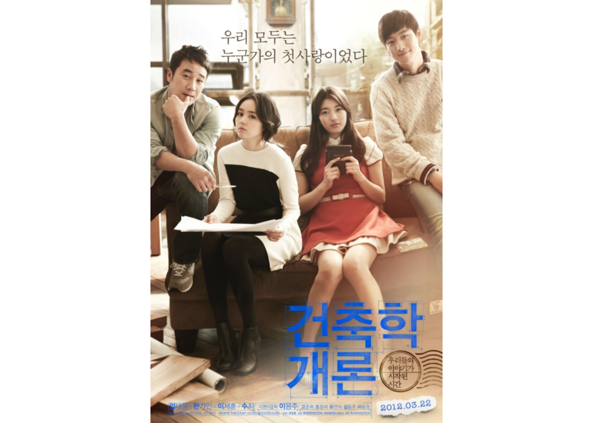

~~~{.r}
# EBImage::display(arch_101, method="browser")
print(arch_101)
~~~

~~~{.output}
Image 
  colorMode    : Color 
  storage.mode : double 
  dim          : 592 859 4 
  frames.total : 4 
  frames.render: 1 

imageData(object)[1:5,1:6,1]
          [,1]      [,2]      [,3]      [,4]      [,5]      [,6]
[1,] 0.4745098 0.4745098 0.4745098 0.4745098 0.4666667 0.4627451
[2,] 0.4745098 0.4745098 0.4745098 0.4745098 0.4666667 0.4627451
[3,] 0.4784314 0.4745098 0.4745098 0.4705882 0.4666667 0.4666667
[4,] 0.4862745 0.4745098 0.4666667 0.4627451 0.4627451 0.4666667
[5,] 0.4862745 0.4784314 0.4705882 0.4627451 0.4627451 0.4666667

~~~

## 2. 이미지 밝기와 명도 조정 

~~~{.r}
# 3. 밝기 조정 ---------------------------------------- 

arch_101_plus <- arch_101 + 0.5
arch_101_minus <- arch_101 - 0.5

par(mfrow=c(1,3))
EBImage::display(arch_101_plus, method="raster")
text(x = 20, y = 20, label = "건축학 개론 밝기 0.5 증가", adj = c(0,1), col = "blue", cex = 1.5, family="nanum")
EBImage::display(arch_101, method="raster")
text(x = 20, y = 20, label = "건축학 개론 원본", adj = c(0,1), col = "blue", cex = 1.5, family="nanum")
EBImage::display(arch_101_minus, title="건축학 개론 밝기 0.5 감소", method="raster")
text(x = 20, y = 20, label = "건축학 개론 밝기 0.5 감소", adj = c(0,1), col = "blue", cex = 1.5, family="nanum")
~~~

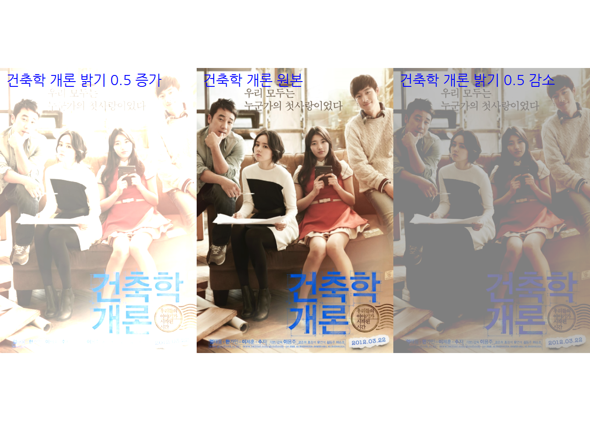

~~~{.r}
# 4. 명도 조정 ---------------------------------------- 
arch_101_div  <- arch_101 * 0.7
arch_101_mult <- arch_101 * 1.5

par(mfrow=c(1,3))
EBImage::display(arch_101_div, method="raster")
text(x = 20, y = 20, label = "건축학 개론 명도 70% ", adj = c(0,1), col = "blue", cex = 1.5, family="nanum")
EBImage::display(arch_101, method="raster")
text(x = 20, y = 20, label = "건축학 개론 원본", adj = c(0,1), col = "blue", cex = 1.5, family="nanum")
EBImage::display(arch_101_mult, title="건축학 개론 밝기 0.5 감소", method="raster")
text(x = 20, y = 20, label = "건축학 개론 명도 150% ", adj = c(0,1), col = "blue", cex = 1.5, family="nanum")
~~~

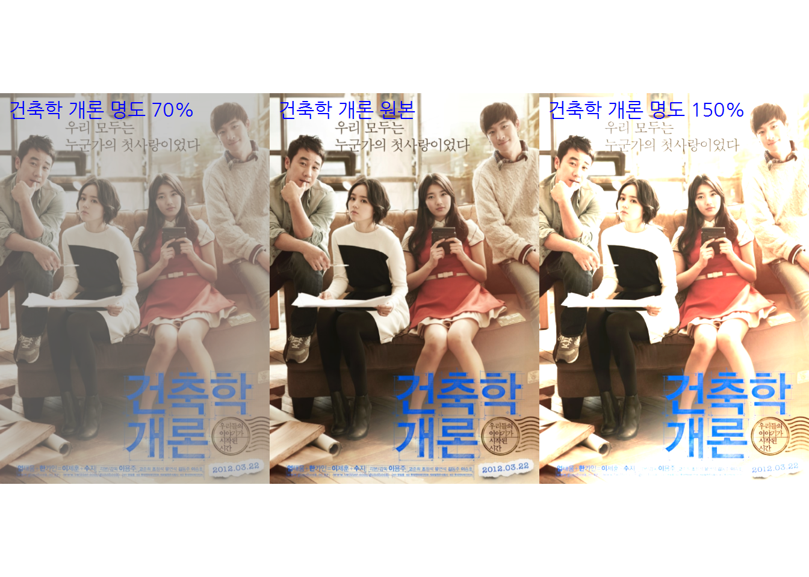

## 3. 이미지 감마($\gamma$) 보정

~~~{.r}
# 5. 감마 보정(Gamma Correction) ---------------------------------------- 
arch_101_gamma_growth  <- arch_101 ^ 2
arch_101_gamma_dimin <- arch_101 ^ 0.5

par(mfrow=c(1,3))
EBImage::display(arch_101_gamma_growth, method="raster")
text(x = 20, y = 20, label = expression(paste("건축학 개론 감마: ", gamma ^2)), adj = c(0,1), col = "blue", cex = 1.5, family="nanum")
EBImage::display(arch_101, method="raster")
text(x = 20, y = 20, label = "건축학 개론 원본", adj = c(0,1), col = "blue", cex = 1.5, family="nanum")
EBImage::display(arch_101_gamma_growth, title="건축학 개론 밝기 0.5 감소", method="raster")
text(x = 20, y = 20, label = expression(paste("건축학 개론 감마: ", gamma ^0.5)), adj = c(0,1), col = "blue", cex = 1.5, family="nanum")
~~~

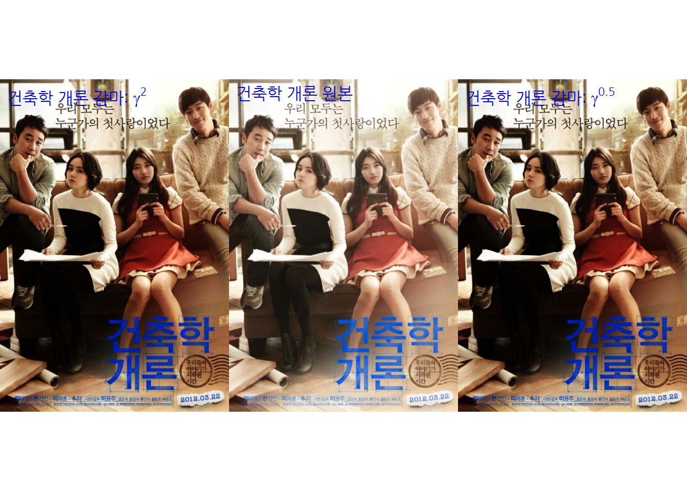

## 4. 이미지 특정영역 잘라내기

~~~{.r}
# 6. 잘라내기(Cropping) ---------------------------------------- 

suji <- arch_101[290:470, 170:550,]
han  <- arch_101[130:290, 170:550,]

par(mfrow=c(1,3))
EBImage::display(han, method="raster")
text(x = 20, y = 20, label = "건축학 개론 감마: 한가인", adj = c(0,1), col = "blue", cex = 1.5, family="nanum")
EBImage::display(arch_101, method="raster")
text(x = 20, y = 20, label = "건축학 개론 원본", adj = c(0,1), col = "blue", cex = 1.5, family="nanum")
EBImage::display(suji, method="raster")
text(x = 20, y = 20, label = "건축학 개론 감마: 수지", adj = c(0,1), col = "blue", cex = 1.5, family="nanum")
~~~

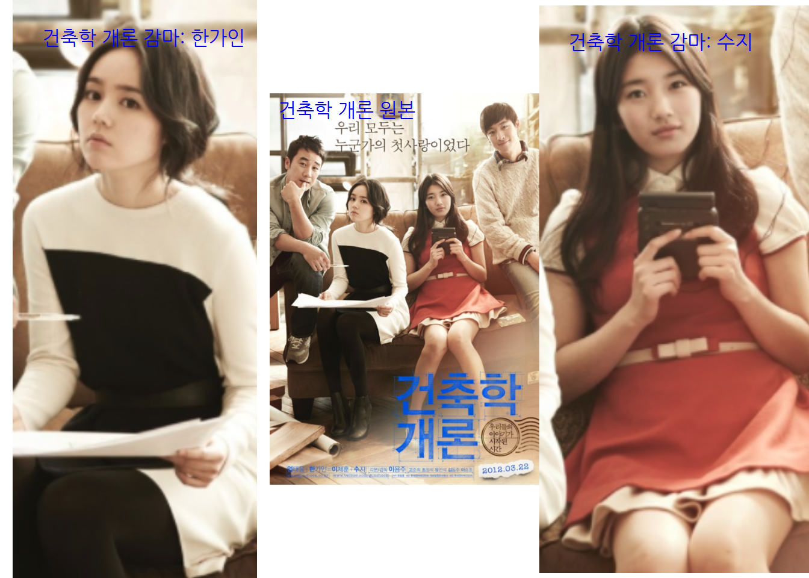

## 5. 이미지 회전과 이동

~~~{.r}
# 7. 공간변환(Spatial Transformation) ---------------------------------------- 
arch_101_rot   <- rotate(arch_101, 45)
arch_101_trans <- translate(arch_101, c(100,200))
arch_101_rot_trans <- translate(rotate(arch_101,45),c(100,200))

par(mfrow=c(1,3))
EBImage::display(arch_101_rot, method="raster")
text(x = 20, y = 20, label = "건축학 개론: 45도 회전", adj = c(0,1), col = "orange", cex = 1.5, family="nanum")
EBImage::display(arch_101_trans, method="raster")
text(x = 20, y = 20, label = "건축학 개론: 우측 300픽셀, 아래 500픽셀 이동", adj = c(0,1), col = "orange", cex = 1.5, family="nanum")
EBImage::display(arch_101_rot_trans, title="건축학 개론 밝기 0.5 감소", method="raster")
text(x = 20, y = 20, label = "건축학 개론: 45도 회전과 이동병행 ", adj = c(0,1), col = "orange", cex = 1.5, family="nanum")
~~~

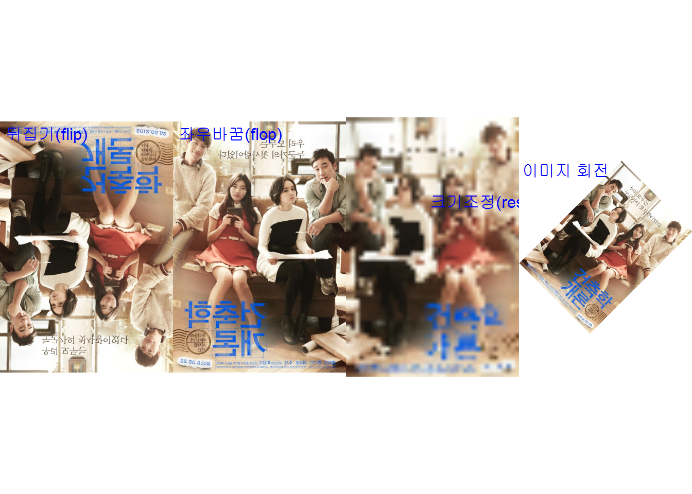

## 6. 이미지 색상관리

~~~{.r}
# 8. 색상 관리(Color Management) ---------------------------------------- 
## 8.1. 흑백과 천연색상
par(mfrow=c(1,2))
colorMode(arch_101) <- Grayscale
EBImage::display(arch_101, method="raster")
text(x = 20, y = 20, label = "건축학 개론: 흑백", adj = c(0,1), col = "blue", cex = 1.5, family="nanum")
colorMode(arch_101) <- Color
EBImage::display(arch_101, method="raster")
text(x = 20, y = 20, label = "건축학 개론: 색상복원", adj = c(0,1), col = "blue", cex = 1.5, family="nanum")
~~~

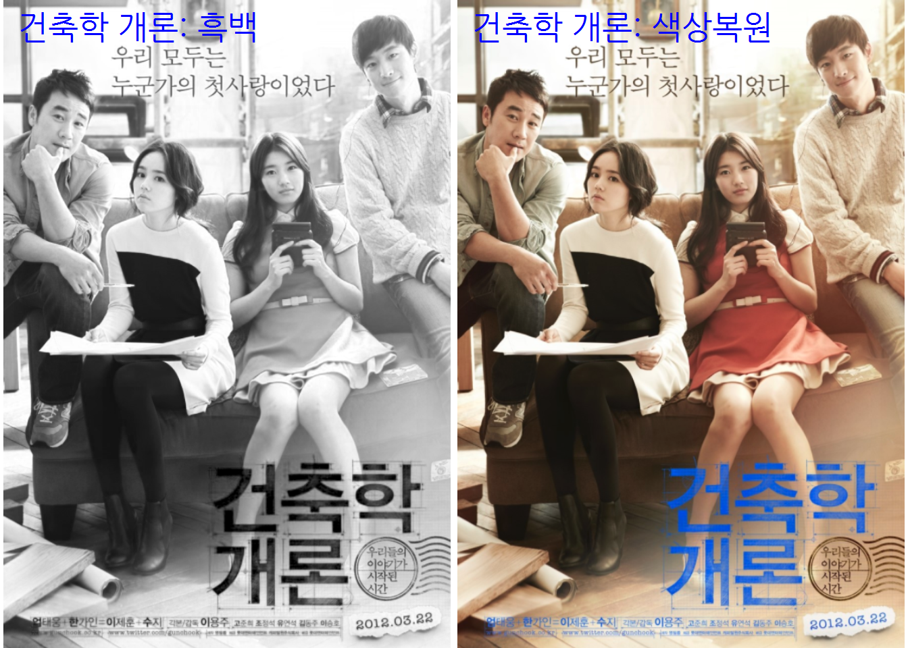

~~~{.r}
## 8.2. RGB 색상결합
arch_101_ch <- channel(arch_101, 'rgb')
arch_101_r <- arch_101_ch[,,1]
arch_101_g <- arch_101_ch[,,2]
arch_101_b <- arch_101_ch[,,3]

par(mfrow=c(1,4))
EBImage::display(arch_101_r, method="raster")
text(x = 20, y = 20, label = "RGB 중 빨강", adj = c(0,1), col = "blue", cex = 1.5, family="nanum")
EBImage::display(flip(arch_101_g), method="raster")
text(x = 20, y = 20, label = "RGB 중 녹색", adj = c(0,1), col = "blue", cex = 1.5, family="nanum")
EBImage::display(flop(arch_101_b), method="raster")
text(x = 20, y = 20, label = "RGB 중 파랑", adj = c(0,1), col = "blue", cex = 1.5, family="nanum")
EBImage::display(rgbImage(arch_101_r, arch_101_g, arch_101_b), method="raster", all=TRUE)
text(x = 20, y = 20, label = "개별 RGB 결합", adj = c(0,1), col = "blue", cex = 1.5, family="nanum")
~~~

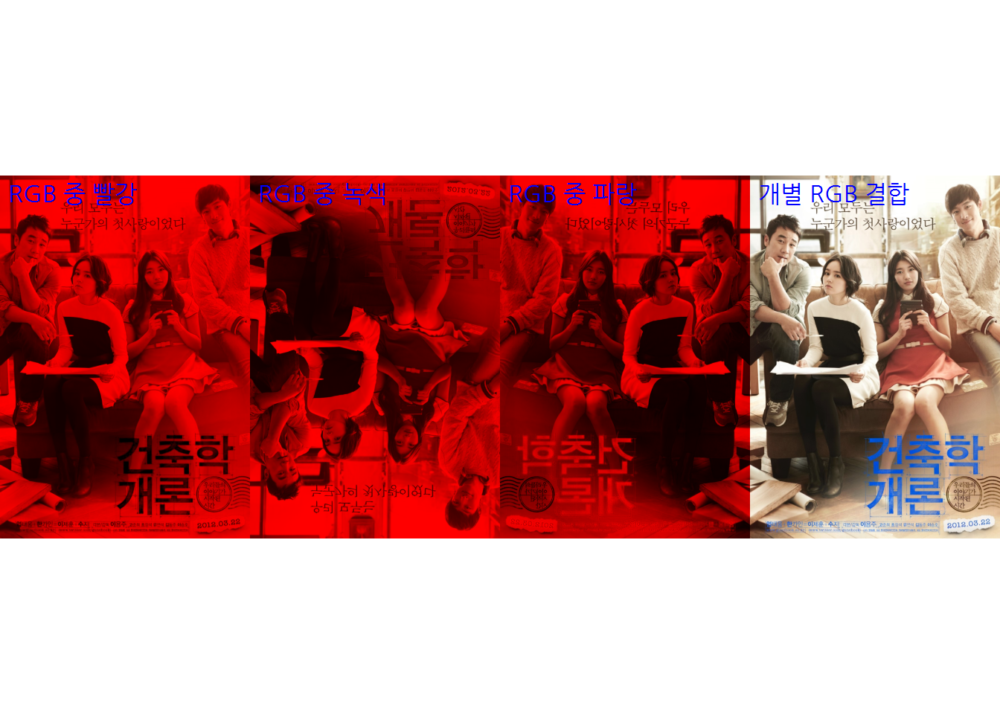

## 7. 이미지 조합

~~~{.r}
# 9. 이미지 결합(Combine) ---------------------------------------- 
## 9.1. 순서대로 결합
rpi_logo <- readImage("fig/raspberrypi-logo.png")
rpi_logo <- resize(rpi_logo, w=dim(arch_101)[1], h=dim(arch_101)[2])

EBImage::display(Image(abind::abind(rpi_logo, arch_101, along=1), colormode=Color), method="raster")
~~~

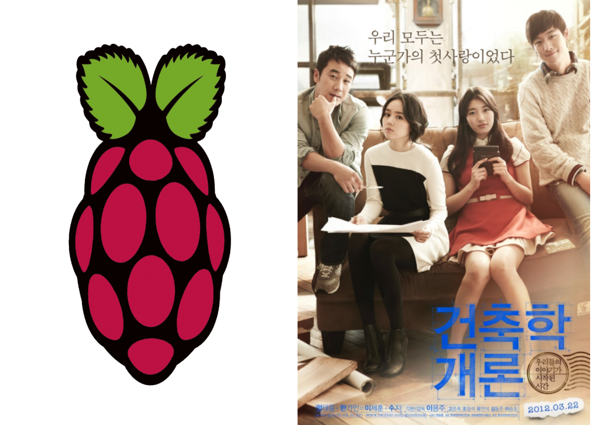

~~~{.r}
## 9.2. 겹쳐서 이미지 결합
arch_rpi <- EBImage::combine(arch_101, rpi_logo)
EBImage::display(arch_rpi, method="raster", all=TRUE)
~~~

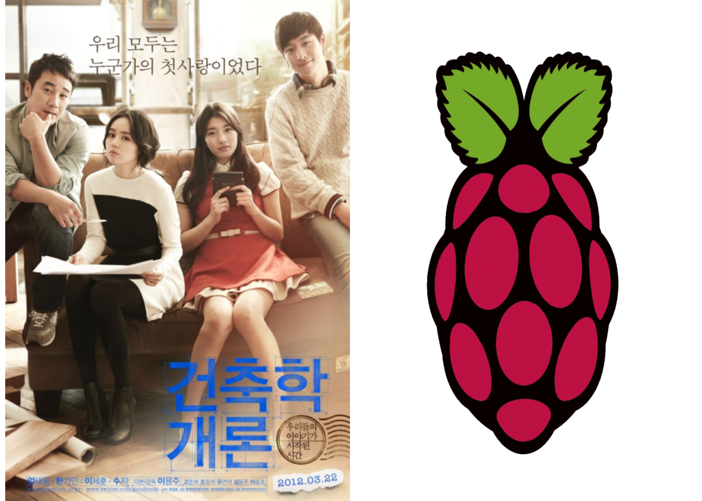

## 8. 이미지 필터링

~~~{.r}
# 10. 고역/저역 필터 ---------------------------------------- 
## 10.1. 저역 필터
fLow <- makeBrush(21, shape= 'disc', step=FALSE)^2
fLow <- fLow/sum(fLow)
arch_101_fLow <- filter2(arch_101, fLow)

## 10.2. 고역 필터
fHigh <- matrix(1, nc = 9, nr = 9)
fHigh[5, 5] <- -64
arch_101_fHigh <- filter2(arch_101, fHigh)

par(mfrow=c(1,3))
EBImage::display(arch_101_fLow, method="raster")
text(x = 20, y = 20, label = "저역필터(Low-pass Filter)", adj = c(0,1), col = "blue", cex = 1.5, family="nanum")
EBImage::display(arch_101, method="raster")
text(x = 20, y = 20, label = "건축학개론 원본", adj = c(0,1), col = "blue", cex = 1.5, family="nanum")
EBImage::display(arch_101_fHigh, method="raster")
text(x = 20, y = 20, label = "고역필터(High-pass Filter)", adj = c(0,1), col = "blue", cex = 1.5, family="nanum")
~~~

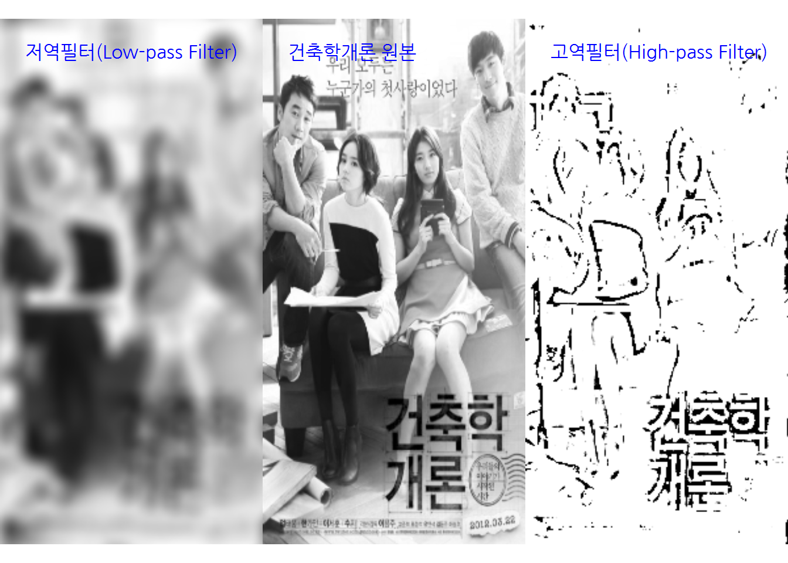

## 9. 이미지 세분화(Segmentation)

~~~{.r}
# 11. 이미지 세분화 ---------------------------------------- 
## 11.1 동전이미지 가져오기
coins <- readImage("fig/quarters_dimes_pennies.png")

## 11.2 흑백이미지
colorMode(coins) <- Grayscale

## 11.3. 임계값 설정

coins_otsu_th  <- coins > otsu(coins, levels=2048)
coins_otsu_th <- opening(coins_otsu_th, makeBrush(5, shape='disc'))
coins_otsu_th <- fillHull(coins_otsu_th)

## 11.4. 동전갯수 

coins_label <- bwlabel(coins_otsu_th)
# max(coins_label)

nbr_coins <- apply(coins_label, 3, max)

cat('동전갯수 [1,2,3]=', '[', nbr_coins[1], ']','[', nbr_coins[2], ']', '[', nbr_coins[3], ']', "\n") 
~~~

~~~{.output}
동전갯수 [1,2,3]= [ 19 ] [ 33 ] [ 45 ] 

~~~

~~~{.r}
## 11.5. 시각화 
par(mfrow=c(1,2))
EBImage::display(coins, method="raster", all=TRUE)
EBImage::display(coins_otsu_th, method="raster", all=TRUE)
~~~

~~~{.r}
par(mfrow=c(1,3))
colorMode(coins) <- Color
EBImage::display(coins, method="raster")
text(x = 20, y = 20, label = "동전 원본 사진", adj = c(0,1), col = "orange", cex = 1.5, family="nanum")
colorMode(coins) <- Grayscale
EBImage::display(coins, method="raster", all=TRUE)
text(x = 20, y = 20, label = "동전 흑백 사진", adj = c(0,1), col = "orange", cex = 1.5, family="nanum")
EBImage::display(coins_otsu_th, method="raster", all=TRUE)
text(x = 20, y = 20, label = "동전 임계값 적용된 사진", adj = c(0,1), col = "orange", cex = 1.5, family="nanum")
~~~

