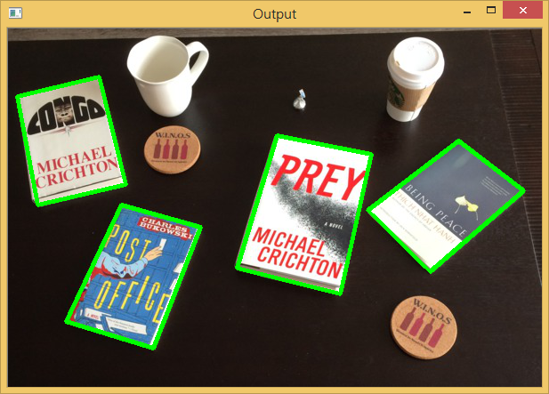
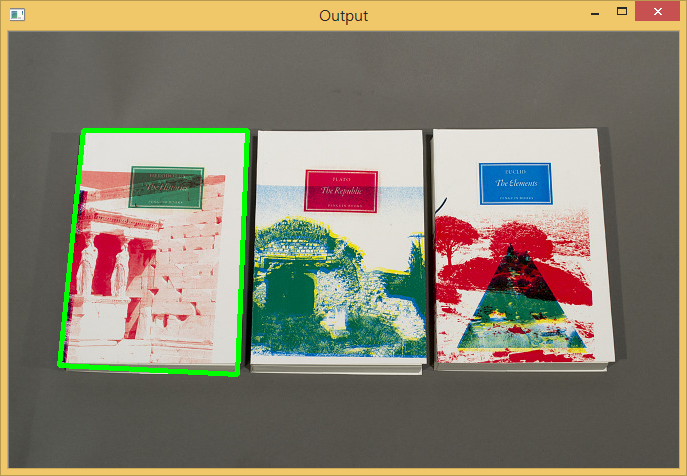

[A guide to finding books in images using Python and OpenCV](https://pythontips.com/2015/03/11/a-guide-to-finding-books-in-images-using-python-and-opencv/) 블로그에 게시된 기사가 평소 관심을 갖고 있던거라 버그가 있어 버그를 수정한 코드로 파이썬2에서 정상 동작하게 만들고 이미지에 들어있는 책이 몇권인지 확인해 봤다.

## 1. 실행결과

~~~ {.output}
I found 4 books in that image
~~~

~~~ {.output}
I found 1 books in that image
~~~

## 2. 파이썬 openCV 코드

~~~ {.python}
# import the necessary packages
import numpy as np
import cv2

# load the image, convert it to grayscale, and blur it
##image = cv2.imread("example.jpg")
##image = cv2.imread("test01.jpg")
##image = cv2.imread("one-book.jpg")
##image = cv2.imread("one-book-plus.jpg")
##image = cv2.imread("four-books.jpg")
image = cv2.imread("three-books.jpg")
gray = cv2.cvtColor(image, cv2.COLOR_BGR2GRAY)
gray = cv2.GaussianBlur(gray, (3, 3), 0)
cv2.imshow("Gray", gray)
cv2.waitKey(0)

# detect edges in the image
edged = cv2.Canny(gray, 10, 250)
cv2.imshow("Edged", edged)
cv2.waitKey(0)

# construct and apply a closing kernel to 'close' gaps between 'white'
# pixels
kernel = cv2.getStructuringElement(cv2.MORPH_RECT, (7, 7))
closed = cv2.morphologyEx(edged, cv2.MORPH_CLOSE, kernel)
cv2.imshow("Closed", closed)
cv2.waitKey(0)

# find contours (i.e. the 'outlines') in the image and initialize the
# total number of books found
(_, cnts, _) = cv2.findContours(closed.copy(), cv2.RETR_EXTERNAL, cv2.CHAIN_APPROX_SIMPLE)
total = 0

# loop over the contours
for c in cnts:
    # approximate the contour
    peri = cv2.arcLength(c, True)
    approx = cv2.approxPolyDP(c, 0.02 * peri, True)

    # if the approximated contour has four points, then assume that the
    # contour is a book -- a book is a rectangle and thus has four vertices
    if len(approx) == 4:
        cv2.drawContours(image, [approx], -1, (0, 255, 0), 4)
        total += 1

# display the output
print "I found {0} books in that image".format(total)
cv2.imshow("Output", image)
cv2.waitKey(0)
~~~

