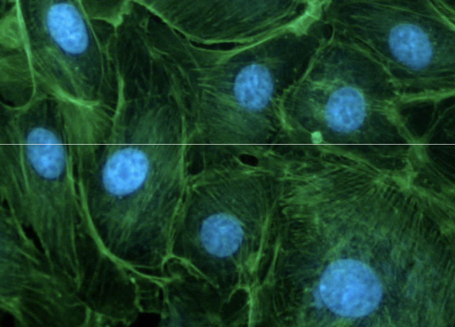

```{r setup, include=FALSE}
knitr::opts_chunk$set(echo = TRUE, message=FALSE, warning=FALSE,
                      comment="", digits = 3, tidy = FALSE, prompt = FALSE, fig.align = 'center')

```

# 대상 이미지 [^download-image] {#image-download}

[^download-image]: ["Bovine Pulmonary Artery Cell Nuclei": UV-1A Longpass Emission (Narrow Bandwidth Excitation) Ultraviolet Set](https://www.microscopyu.com/gallery-images/bovine-pulmonary-artery-cell-nuclei-3)

["Bovine Pulmonary Artery Cell Nuclei": UV-1A Longpass Emission (Narrow Bandwidth Excitation) Ultraviolet Set](https://www.microscopyu.com/gallery-images/bovine-pulmonary-artery-cell-nuclei-3) 웹사이트에서 이미지 분석에 사용될 이미지를 다운로드 한다.

```{r mgaick-image-nuclei, eval = FALSE}
webshot2::webshot(url = "https://www.microscopyu.com/gallery-images/bovine-pulmonary-artery-cell-nuclei-3", selector = '#contentbody > div.featuredimage > img', file = "fig/nuclei.png")
```



파란색 세포핵을 추출하기 위해서 다음과 `image_morphology()` 과정을 거친다.

```{r show-downloaded-image}
library(tidyverse)
library(magick)

nuclei_img <- image_read("fig/nuclei.png")

result <- nuclei_img %>% 
  image_channel(channel = "blue") %>%
  image_morphology(method = "OpenIntensity", kernel = "ConvexHull", iterations = 10) %>%
  image_morphology(method = "Dilate", kernel = "Disk", iterations = 1) %>%
  image_morphology(method = "Erode", kernel = "Disk", iterations = 1) %>%
  image_fuzzycmeans() %>%
  image_threshold(type = "white") %>%
  image_connect() %>% 
  image_split(keep_color = FALSE)

result
```

원본 이미지와 추출한 세포핵 이미지를 겹쳐 시각화한다.

```{r show-downloaded-image-magick}
image_composite(result, nuclei_img, operator = "Out")
```


# 신문 문단 구분 [^newspaper-paragraph] {#newspaper-paragraph}

[^newspaper-paragraph]: [ropensci/magick, "feature request: morphology #136"](https://github.com/ropensci/magick/issues/136)

신문 기사 문단을 구분해보자.

```{r newspaper-paragraph}

pdfurl <- "https://user-images.githubusercontent.com/13419011/46260346-f235cd80-c4e4-11e8-801a-61865e570a69.jpeg"
newspaper_img <- image_read(pdfurl) %>% 
    image_convert(format="png", type="Grayscale") %>% 
    image_negate() %>% 
    image_lat(geometry = "50x50+10%") %>% 
    image_negate() %>% 
    image_deskew()

newspaper_img
```

문단을 다음 알고리즘으로 추출해보자.

```{r newspaper-paragraph-overlay}
paragraph_newspaper <- newspaper_img %>%
    image_negate() %>% 
    image_morphology(method="Dilate", kernel="Rectangle:10x15") %>% 
    image_edge(radius = 2) %>% 
    image_hough_draw(geom="10x10+400", bg="transparent")

paragraph_newspaper
```

추출된 문단과 뉴스기사 이미지를 겹쳐보자.

```{r composite-newspaper-paragraph}
image_composite(newspaper_img, paragraph_newspaper)
```

# 직선 탐지 {#detect-lines}

[`dmi3kno/bunny`](https://github.com/dmi3kno/bunny) 팩키지를 활용하여 직선을 탐지해낸다.

```{r magick-detect-line}
# remotes::install_github("dmi3kno/bunny")
library(bunny)

nuclei_img %>% image_convert(type="Grayscale") %>% 
  image_canny() %>% 
  image_morphology("Close", "Diamond") %>% 
  image_hough_draw(geometry="50x50+200",overlay = TRUE)

nuclei_img %>% image_convert(type="Grayscale") %>% 
  image_canny() %>% 
  image_hough_txt(geometry="50x50+100") %>% 
  tidy_hough_mvg()
```

