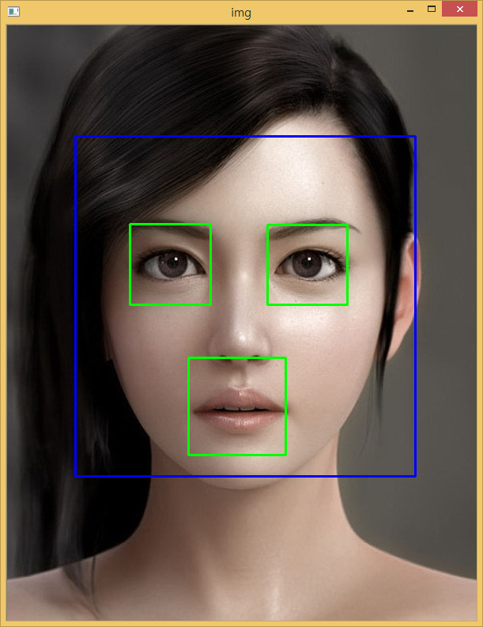

## 1. Haar 케스케이드 

Haar 케스케이드(Cascade)를 활용하여 사진 속 얼굴과 눈을 인식해본다.

Haar 케스케이드 눈과 얼굴 xml 파일을 구해 이것을 이미지 속 얼굴을 탐지한다.

* [Haar 케스케이드 -- 눈](https://raw.githubusercontent.com/Itseez/opencv/master/data/haarcascades/haarcascade_eye.xml)
* [Haar 케스케이드 -- 얼굴](https://raw.githubusercontent.com/Itseez/opencv/master/data/haarcascades/haarcascade_frontalface_default.xml)

## 2. 파이썬 코드 [^opencv-haar]

[^opencv-haar]: [Face Detection using Haar Cascades](http://docs.opencv.org/3.1.0/d7/d8b/tutorial_py_face_detection.html)

* 얼굴과 눈 케스케이드를 입력받아 저장해 놓는다.
* 얼굴과 눈을 인식할 이미지를 불러온다.
* 먼저 이미지에서 얼굴을 인식하고 나서 사각형을 그려 넣는다 &rarr; 청색(255,0,0)
    * 얼굴 영역내에서 두 눈의 위치를 식별해 사각형을 위치시킨다 &rarr; 노란색(0,255,0)

~~~ {.python}
import numpy as np
import cv2
 
face_cascade = cv2.CascadeClassifier('cascade/haarcascade_frontalface_default.xml')
eye_cascade = cv2.CascadeClassifier('cascade/haarcascade_eye.xml')
 
img = cv2.imread('../fig/female-frontface.jpg')
##img = cv2.imread('../fig/many-frontface.jpg')

gray = cv2.cvtColor(img, cv2.COLOR_BGR2GRAY)

faces = face_cascade.detectMultiScale(gray, 1.2, 1)
for (x,y,w,h) in faces:
    cv2.rectangle(img,(x,y),(x+w,y+h),(255,0,0),2)
    roi_gray = gray[y:y+h, x:x+w]
    roi_color = img[y:y+h, x:x+w]
    eyes = eye_cascade.detectMultiScale(roi_gray)
    for (ex,ey,ew,eh) in eyes:
        cv2.rectangle(roi_color,(ex,ey),(ex+ew,ey+eh),(0,255,0),2)

cv2.imshow('img',img)
cv2.waitKey(0)
cv2.destroyAllWindows()
~~~

