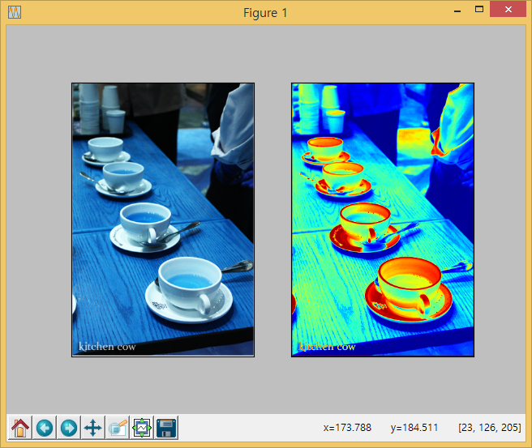

[이미지넷](http://image-net.org/)에서 받아온 이미지 파일 한개에 대해 명암단계(grayscale) 변환작업을 수행한다.

## 1. 코드 설명 

1. 변환 작업을 수행할 이미지 파일 선정
    * `import os` 팩키지를 불러와서 `chdir` 메쏘드로 이미지 디렉토리로 이동한다.
    * `import glob` 팩키지 `glob` 메쏘드로 `tea` 디렉토리 `*.jpg` 파일에 대한 목록을 생성한다.
    * 8번째 이미지 파일을 특정한다.
1. `import cv2` 팩키지 `imread` 메쏘드로 8번째 파일을 작업 파일로 불러와서 `orig_img`로 저장한다.
1. `cv2.cvtColor(orig_img, cv2.COLOR_RGB2GRAY)` 명령어로 명암단계 변환작업을 수행하고 `gray_img` 객체로 저장한다.
1. `matplotlib` 팩키지로 하나의 화면을 두개로 쪼개 원본 이미지와 명암단계 변환한 이미지를 함께 창에 뿌려준다.

~~~ {.python}
import cv2
import os
import matplotlib.pyplot as plt
import glob

## Select Image
os.chdir("tea")
jpg_files = glob.glob("*.jpg")

infile = jpg_files[7]

## Image Converstion
orig_img = cv2.imread(infile)
gray_img = cv2.cvtColor(orig_img, cv2.COLOR_RGB2GRAY)

## Matplotlib Viz.
plt.subplot(1,2,1)
plt.imshow(orig_img)
plt.xticks([]), plt.yticks([])  # Hide X and Y axis tick values

plt.subplot(1,2,2)
plt.imshow(gray_img)
plt.xticks([]), plt.yticks([])  # Hide X and Y axis tick values

plt.show()

~~~

