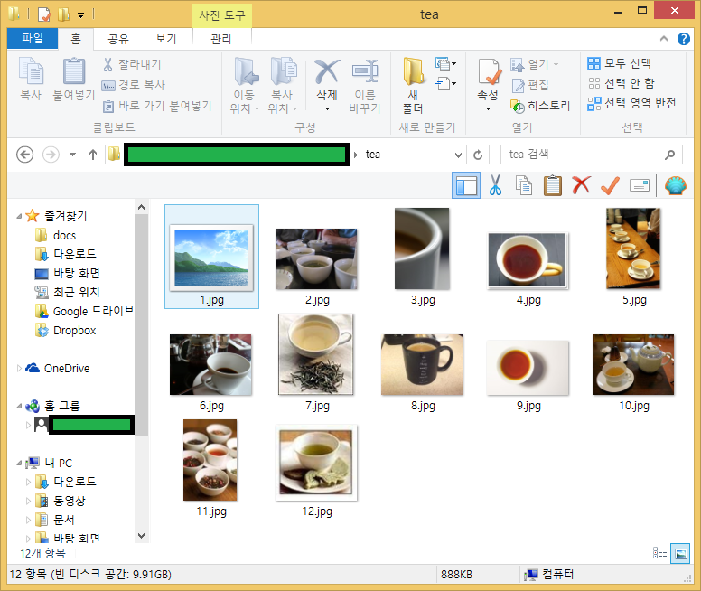

기계학습 모형을 개발할 때 이미지 데이터가 대량으로 필요하다. [이미지넷](http://image-net.org/)이 연구용으로 작업하기 좋은 데이터를 대량으로 손쉽게 구할 수 있는 통로이기도 하다. 인터넷에서 연구용으로 이미지 데이터를 준비하는 방법을 살펴보자.

## 1. 다운로드 대상파일 선정

[이미지넷](http://image-net.org/)에 다양한 분류에 따라 수천장의 이미지가 있는 경우도 있다. 
작성한 코드가 정상작동하는지 확인하려는 목적이기 때문에 분류체계에 따라 가장 적은 이미지를 분류집단을 찾아야 하는데,
현재 시간 기준('16년5월26일) `Misc(20400)` &rarr; `tea-like drink` 에 23장 차관련 이미지가 있다.

[http://image-net.org/api/text/imagenet.synset.geturls?wnid=n07933530](http://image-net.org/api/text/imagenet.synset.geturls?wnid=n07933530)

상기 url에 포함된 이미지 파일 링크는 다음과 같다.

1. http://open.salon.com/files/tea_cup_small1259088246.jpg
1. http://www.teageek.net/Images/TeaTasting3.jpg
1. http://farm1.static.flickr.com/29/45497721_fb90fefa74.jpg
1. http://mortalcore.com/wp-content/uploads/2009/06/istock_000005851440xsmall-300x199.jpg
1. http://c2.api.ning.com/files/ldu*IIBKr68CKtLHAYP3DpsspxMhWj-e8PIBGotCENVGjIFVF6e1yFAvqiqZhwg1. vwjG50f9k5n9GOUVKG4xUP8x-kidLy12V/turkish_coffee.jpg
1. http://www.health-outlook.com/wp-content/uploads/2009/03/tea.jpg
1. http://blog.hotelclub.com/wp-content/uploads/2008/09/hot-buttered-rum.jpg
1. http://ndn3.newsweek.com/media/14/080402_GreenTea_vl-vertical.jpg
1. http://www.green-tea-expert.com/images/green-tea2.jpg
1. http://www.agriculturalproductsindia.com/images/tea1.jpg
1. http://www.teaworld.co.uk/images/teaLemon123.jpg
1. http://farm3.static.flickr.com/2342/2445546884_3b08d9c25a_o.jpg
1. http://farm4.static.flickr.com/3220/3105599324_0049f02d87.jpg
1. http://static.squidoo.com/resize/squidoo_images/-1/lens6175262_1249329862Mugicha.jpg
1. http://www.fresnodog.com/images/whitetea.jpg
1. http://thefeministbreeder.typepad.com/.a/6a00e54ed890f88833011168682476970c-200wi
1. http://www.theteahouse.com/topics1.jpg
1. http://farm4.static.flickr.com/3249/3286589010_2cbc20d1c5_o.jpg
1. http://i30.tinypic.com/117sojt.jpg
1. http://farm1.static.flickr.com/1/546852_90153feb56.jpg
1. http://teaguide.files.wordpress.com/2009/08/customblendimage.jpg
1. http://4.bp.blogspot.com/_3DCs5bz7mdM/Sm0ck3s5r5I/AAAAAAAAB4s/KjfHq35beQ0/s320/1. Camellia+and+teacup.jpg
1. http://img.tradeindia.com/fp/thumb/1/385/188.jpg

## 2. 파일 다운로드 파이썬 코드 작성 [^sentdex-urllib]

[^sentdex-urllib]: [download images with urllib](http://stackoverflow.com/questions/35959095/download-images-with-urllib)

파이썬3 `urllib` 라이브러리를 사용해서 이미지 파일을 다운로드한다.

1. 다운로드할 이미지를 품고있는 이미지넷 url을 확인한다.
1. 다운로드할 이미지를 저장할 디렉토리를 생성한다 -- 존재하지 않을 경우 디렉토리를 `tea` 이름으로 새로 생성한다.
1. `urllib.request.urlretrieve` 메쏘드를 사용해서 인덱스 숫자를 파일명으로 확장자를 `.jpg`로 하여 다운로드한다.

~~~ {.python}
import urllib.request
import os

def save_images_from_image_net():
    tea_images_link = 'http://image-net.org/api/text/imagenet.synset.geturls?wnid=n07933530'
    tea_image_urls = urllib.request.urlopen(tea_images_link).read().decode()

    pic_idx = 1

    if not os.path.exists('tea'):
        os.makedirs('tea')

    for i in tea_image_urls.split('\n'):
        try:
            print(".......", i)
            urllib.request.urlretrieve(i, "tea/"+str(pic_idx)+".jpg")
            pic_idx += 1

        except Exception as e:
            print(str(e))
        
if __name__ == "__main__": 
    save_images_from_image_net()
~~~

## 3. 작업결과 검토

[이미지넷](http://image-net.org/)에 이미지 파일이 저장되어 있지만 웹서버가 수리중이거나, 이미지 파일위치가 변경되었거나, 네트워크 환경이 작업 당시 좋지 않거나 여러가지 사유로 인해 정상동작하지 않을 수 있다. 정상적으로 다운로드된 이미지 파일과 결과를 출력 로그를 통해서 확인할 수 있다. 대상 23개 이미지 중 12개만 정상 다운로드된 것을 확인할 수 있다.

~~~ {.output}
....... http://open.salon.com/files/tea_cup_small1259088246.jpg
....... http://www.teageek.net/Images/TeaTasting3.jpg
....... http://farm1.static.flickr.com/29/45497721_fb90fefa74.jpg
....... http://mortalcore.com/wp-content/uploads/2009/06/istock_000005851440xsmall-300x199.jpg
<urlopen error [Errno 11001] getaddrinfo failed>
....... http://c2.api.ning.com/files/ldu*IIBKr68CKtLHAYP3DpsspxMhWj-e8PIBGotCENVGjIFVF6e1yFAvqiqZhwgvwjG50f9k5n9GOUVKG4xUP8x-kidLy12V/turkish_coffee.jpg
HTTP Error 404: Not Found
....... http://www.health-outlook.com/wp-content/uploads/2009/03/tea.jpg
<urlopen error [WinError 10060] 연결된 구성원으로부터 응답이 없어 연결하지 못했거나, 호스트로부터 응답이 없어 연결이 끊어졌습니다>
....... http://blog.hotelclub.com/wp-content/uploads/2008/09/hot-buttered-rum.jpg
HTTP Error 503: Service Unavailable
....... http://ndn3.newsweek.com/media/14/080402_GreenTea_vl-vertical.jpg
<urlopen error [Errno 11001] getaddrinfo failed>
....... http://www.green-tea-expert.com/images/green-tea2.jpg
<urlopen error [WinError 10060] 연결된 구성원으로부터 응답이 없어 연결하지 못했거나, 호스트로부터 응답이 없어 연결이 끊어졌습니다>
....... http://www.agriculturalproductsindia.com/images/tea1.jpg
....... http://www.teaworld.co.uk/images/teaLemon123.jpg
<urlopen error [WinError 10060] 연결된 구성원으로부터 응답이 없어 연결하지 못했거나, 호스트로부터 응답이 없어 연결이 끊어졌습니다>
....... http://farm3.static.flickr.com/2342/2445546884_3b08d9c25a_o.jpg
....... http://farm4.static.flickr.com/3220/3105599324_0049f02d87.jpg
....... http://static.squidoo.com/resize/squidoo_images/-1/lens6175262_1249329862Mugicha.jpg
HTTP Error 404: Not Found
....... http://www.fresnodog.com/images/whitetea.jpg
....... http://thefeministbreeder.typepad.com/.a/6a00e54ed890f88833011168682476970c-200wi
HTTP Error 404: Not Found
....... http://www.theteahouse.com/topics1.jpg
HTTP Error 404: Not Found
....... http://farm4.static.flickr.com/3249/3286589010_2cbc20d1c5_o.jpg
....... http://i30.tinypic.com/117sojt.jpg
....... http://farm1.static.flickr.com/1/546852_90153feb56.jpg
....... http://teaguide.files.wordpress.com/2009/08/customblendimage.jpg
....... http://4.bp.blogspot.com/_3DCs5bz7mdM/Sm0ck3s5r5I/AAAAAAAAB4s/KjfHq35beQ0/s320/Camellia+and+teacup.jpg
HTTP Error 404: Not Found
....... http://img.tradeindia.com/fp/thumb/1/385/188.jpg
....... 
unknown url type: ''
....... 
unknown url type: ''
~~~

