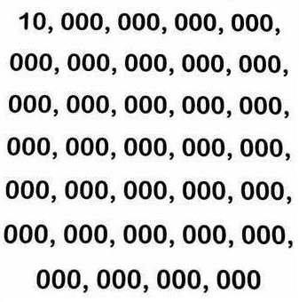

## 1. 업무분장

과거 인간과 기계(컴퓨터) 사이 업무분장은 **계산** 은 컴퓨터, **추론** 과 **인지** 는 인간이 하는 것으로 나뉘어져 있었다.
하지만, 이런 업무분장이 최근들어 많이 흔들리고 있다. 이제 컴퓨터가 강력한 계산기능을 거의 무한으로 확장하여
추론과 인지분야까지 파고들고 있다. 

이런 강력한 기계의 발전에는 무한 연산작업을 가능하게 한 클라우드 컴퓨팅과 더불어 거의 무한대에 가까운 데이터를 저장하는 빅데이터 관리체계가 그 기반이 되었고, 이를 기반으로 추론을 강화시키는 기계학습(machine learning)과 인간이 정보의 상당부분을 인지하는 시각적인 기능을 인지하는 능력을 컴퓨터 비젼 등을 통해 급격히 향상시켰다.

0의 갯수가 몇개인지 파악할 수 있을까? 사람은 사진을 보고 1이 하나이고 0이 상당히 많다는 인지를 하지만, 정확하게 0이 몇개인지 파악하려면 쉽지 않은 문제가 된다. 하지만, 컴퓨터 기계에게 있어서 그건 문제도 아니다. 0과 1을 인지만 시키면 강력한 계산기능을 통해 인간보다 빠르고 정확하게 파악할 수 있다.

상기 사진은 $Googol(10^{100})$에서 나왔다.

## 2. 이미지 기초 정보 [^image-size]

[^image-size]: [How do I calculate the file size for a digital image?](http://4nsi.com/faq/how-do-i-calculate-the-file-size-for-a-digital-image)

**픽셀(pixel)** 은 디지털 이미지의 기본단위가 된다. 과거 모니터 해상도로 많이 사용된 $1,024 \times 768$ 크기를 갖는 이미지는 열이 1,204, 행이 768로 되어 총 $1,024 \times 768 = 786,432$ 픽셀을 갖게 된다. 픽셀 숫자를 알고 있다고 해서 픽셀 크기가 정해지는 것은 아니다. 펙셀이 찍히는 이미지 크기도 중요한 정보가 된다. 넓은 면적보다 좁은 면적에 찍히는 픽셀수가 좀더 선명한 색상을 띄게 된다. 크기와 관련하여 도입되는 개념이 인치당 픽셀(pixcel per inch), 즉 **ppi** 가 된다.

픽셀이 있으면 픽셀에 대한 연관된 색상정보도 필요하다. 이를 **색상 깊이(color depth)** 라고도 부른다.
색상깊이는 이미지에 사용될 수 있는 최대 가능한 색상을 표시한다. 

이미지 크기를 계산하는 순서는 다음과 같다.

1. 픽셀 가로와 픽셀 세로를 곱한다.
1. 픽셀당 사용되는 색상깊이를 곱한다.
1. 8로 나누기하여 바이트로 단위를 고정시킨다.
1. 킬로바이트가 최종 파일크기 단위면 1,024로 나누고, 메가바이트가 최종 파일크기면 다시 1,024로 나눈다. 

|    단위    |  영문표기  |      환산     |   바이트 환산 |
|-----------|----------|---------------|-----------------|
| 1 바이트    |  1 Byte  |   8 비트        |     |
| 1 킬로바이트 |  1 KB    | 1,024 바이트     |     |
| 1 메가바이트 |  1 MB    | 1,024 킬로바이트  |      1,048,576 바이트 |
| 1 기가바이트 |  1 GB    | 1,024 메가바이트  |  1,073,741,824 바이트  |

> ### 메가바이트 변환공식 {.callout}
> 
> 파일 크기 (MByte) = 
> 
> $$ 펙셀숫자 \times 색상깊이 \div 8 \div 1,024 \div 1024 $$

$1,920 \times 1,536 = 2,949,120$, 즉 2.95 메가픽셀을 갖는 
이미지를 고급 디지털 카메라로 $256(2^{8})$ 색상으로 사진을 찍게 되면, 사진을 찍을 때마다 90 MByte 저장 공간이 필요하다.

$$\begin{align}
 1,920 \times 1,536 \times 256 &= 754,974,720 \div 8 \\
                                 &= 94,371,840 바이트 \div 1,024 \\
                                 &= 92,160 킬로바이트 \div 1,024  \\
                                 &= 90 메가바이트 \end{align}
$$ 

### 2.1. 다양한 압축 이미지 파일형식

이와 같이 커다란 저장공간을 차지하는 이미지 크기 때문에, GIF, PNG, JPEG 같이 이미지 크기를 효율적으로 압축하는 다양한 파일형식이 존재한다. 

### 2.2. 픽셀 표현 방식

픽셀을 표현하는 방식은 흑백(grayscale)과 칼라색상(color) 방식으로 나뉜다. 
흑백은 단순한데, 흑백은 검은색이면 하나면 `0`으로 두고, 나머지 모두를 흰색 `255`로 표현하게 된다.

칼라색상은 RGB 적색(R, Red), 녹색(G, Green), 청색(B, Blue)을 가색하여 색상을 표현한다. 각각은 0 -- 255 값, 즉 256가지 값을 갖는다. 색상을 읽는 법은 $(255,165,0)$을 예로들면, 오렌지색인데 적색 255 최대, 녹색이 165 중간, 청색이 0 하나도 없게 되고 이를 다 합치면 오렌지색이 된다. 

|  색상   |  RGB 표현     |
|--------|--------------|
| 적색    | (255, 0, 0) |
| 녹색    | (0, 255, 0) |
| 청색    | (0, 0, 255) |
| 노랑색   | (255, 255, 0) |
| 갈색    | (165, 42, 42) |
| 오렌지색 |  (255, 165, 0) |
| 검정색   | (0, 0, 0) |
| 흰색    | (255, 255, 255) |

