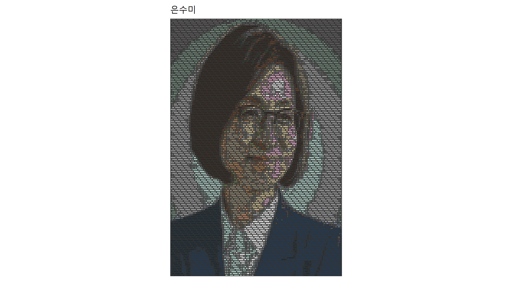

``` {r, include=FALSE}
source("tools/chunk-options.R")
knitr::opts_chunk$set(echo = TRUE, warning=FALSE, message=FALSE)
```

# 레고 이미지 [^lego-image] {#lego-img}

[^lego-image]: [LEGO Mosaics from images using R and #tidyverse](https://github.com/ryantimpe/LEGOMosaics/)

[Ryan Timpe](http://www.ryantimpe.com/)가 이미지를 레고형태로 표현하는 R 코드를 작성했다. 
GitHub [LEGO Mosaics from images using R and #tidyverse](https://github.com/ryantimpe/LEGOMosaics/) 사이트에서 
관련된 내용을 확인할 수 있다.


# 이미지 가져오기 {#legoize}

민주당 [은수미 성남시장 후보](https://search.naver.com/search.naver?where=nexearch&sm=top_hty&fbm=1&ie=utf8&query=%EC%9D%80%EC%88%98%EB%AF%B8)
인물정보 대표 사진을 네이버에서 다운로드 받아 이를 저장한다. 

JPEG 이미지라 이를 `jepg` 팩키지 `readJPEC()` 함수로 불러 와서 제대로 불러왔는지 확인한다.

``` {r lego-setup}
# 0. 환경설정 -----
# source("0_Functions.R")
library(jpeg)

# 1. 이미지 다운로드 -----
## 이미지 주소
esm_url <- "https://search.pstatic.net/common?type=a&amp;size=120x150&amp;quality=95&amp;direct=true&amp;src=http%3A%2F%2Fsstatic.naver.net%2Fpeople%2F62%2F201804091126335951.jpg"
download.file(esm_url, destfile="fig/esm.jpg", mode = 'wb')

# 2. 이미지 살펴보기 -----
esm_photo <- readJPEG("fig/esm.jpg")
esm_dim <- dim(esm_photo)[2:1] # 사진 [x, y] 차원

plot(1,1, xlim=c(1,esm_dim[1]),ylim=c(1,esm_dim[2]),asp=1,type='n',xaxs='i',yaxs='i',xaxt='n',yaxt='n',xlab='',ylab='',bty='n')
rasterImage(esm_photo,1,1,esm_dim[1],esm_dim[2])
```

# 은수미 후보 사진 레고화 {#lego-esm}

다운로드 받은 사진 이미지크기가 $120 \times 150$ 이라 크기를 정해주고 이를 레고이미지로 변환시킨다.

``` {r legoize-esm, eval=FALSE}
# 3. 레고 이미지 -----
esm_mosaic <- readJPEG("Images/esm.jpg") %>% 
  scale_image(c(120, 150)) %>% # c(W, H) for rectangle
  legoize() %>% 
  collect_bricks("stacked") 

esm_gg <- esm_mosaic %>% display_set("은수미")

ggsave("Images/esm_lego.png")
```



