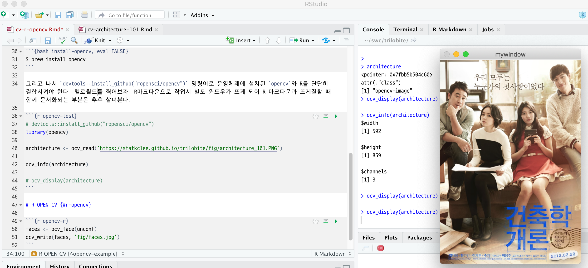

```{r setup, include=FALSE}
knitr::opts_chunk$set(echo = TRUE, message=FALSE, warning=FALSE,
                      comment="", digits = 3, tidy = FALSE, prompt = FALSE, fig.align = 'center')
```

# R OPEN CV [^opencv-example] {#r-opencv}

[^opencv-example]: [Hatena Blog, "Rからopencvを使ってみる"](http://r-beginner.hatenadiary.jp/entry/2018/09/19/153314)

## 윈도우 {#install-windows-opencv}

윈도우에서 `opencv`를 사용하기 위해서는 윈도우용 OpenCV를 설치하고, Rtools도 설치해야 된다.
그리고 나서 OpenCV와 R을 연결시키는 `opencv` 팩키지를 설치하면 구성이 완성된다.

- [윈도우10(Windows10) OpenCV 설치하기(1)](https://yongku.tistory.com/entry/%EC%9C%88%EB%8F%84%EC%9A%B010Windows10-OpenCV-%EC%84%A4%EC%B9%98%ED%95%98%EA%B8%B01)
- [Rtools install - 설치하기](https://codedragon.tistory.com/6865)


```{r windows-install, eval FALSE}
devtools::install_github("ropenscilabs/opencv")
```

## 맥 {#opencv-mac}

`opencv`를 사용하기 위해서는 먼저 `opencv`를 설치해야만 한다. 그리고 난 후 [opencv](https://github.com/ropensci/opencv) 팩키지를 설치하여 바인딩한다. 

```{bash install-opencv, eval=FALSE}
$ brew install opencv
```

그리고 나서 `devtools::install_github("ropensci/opencv")` 명령어로 운영체제에 설치된 `opencv`와 R를 단단히 결합시켜야 한다. 헬로월드를 찍어보자. R마크다운으로 작업시 별도 윈도우가 뜨게 되어 R 마크다운과 뜨게질할 때 함께 문서화되는 부분은 추후 살펴본다.

```{r opencv-test}
# devtools::install_github("ropensci/opencv")
library(opencv)

architecture <- ocv_read('https://statkclee.github.io/trilobite/fig/architecture_101.PNG')

ocv_info(architecture)

# ocv_display(architecture)
```

{#id .class}

# 얼굴 추출 {#r-opencv-face}

가장 먼저 `OpenCV`하면 얼굴 식별이 떠오른다. 이를 위해서 2019년 R 연말모임에 참석하신 분 대상으로 얼굴을 추출해보자.

```{r opencv-r}
library(magick)

yearend <- ocv_read('fig/R-yearend-meeting.jpeg')

yearend_faces <- ocv_face(yearend)
# ocv_write(yearend_faces, 'fig/yearend_faces.png')

yearend_img <- image_read('fig/yearend_faces.png')

yearend_img
```

## 한사람 얼굴 추출 {#extract-face-one}

`ocv_facemask()` 함수를 사용해서 얼굴을 추출한다. `attr()` 함수로 "faces"를 추출해낸다. 
그리고 나서, `magick` 팩키지 `image_crop()` 함수를 사용해서 얼굴만 추출하는데 `geometry_area` 함수를 사용한다.

- `x_off` 시작 X 좌표: x_off=facemask_df[1,]$x - facemask_df[1,]$radius
- `y_off` 시작 Y 좌표: y_off=facemask_df[1,]$y - facemask_df[1,]$radius
- `width` 폭: width=facemask_df[1,]$radius*2
-`heigth` 높이: height=facemask_df[1,]$radius*2

```{r extract-face-one-person}
yearend_facemask <- ocv_facemask(yearend_faces)
facemask_df <- attr(yearend_facemask, 'faces')

one_face <- image_crop(yearend_img, geometry_area(x_off=facemask_df[1,]$x - facemask_df[1,]$radius,
                                      y_off=facemask_df[1,]$y - facemask_df[1,]$radius,
                                      width=facemask_df[1,]$radius*2, 
                                      height=facemask_df[1,]$radius*2), repage = TRUE)

image_scale(one_face, "x200")
```

## 모든 얼굴 추출 {#extract-face-all}

한사람 얼굴을 추출했기 때문에 모든 얼굴을 `for` 루프를 돌려 추출하여 `all_faces_list` 리스트 객체에 담아둔다.
그리고 나서, 추출된 얼굴을 `stacked_faces` 객체에 쭉 연결시킨다.

```{r extract-face-all}
# 모든 얼굴을 추출하여 리스트 객체 담아두기
all_faces_list <- list()

for(i in 1:nrow(facemask_df)){
  all_faces_list[[i]] <- yearend_img %>% 
      image_crop(geometry_area(x_off=facemask_df[i,]$x - facemask_df[i,]$radius,
                  y_off=facemask_df[i,]$y - facemask_df[i,]$radius,
                  width=facemask_df[i,]$radius*2, 
                  height=facemask_df[i,]$radius*2), repage = TRUE)
}

# 리스트객체에서 모든 얼굴을 쭉 이어붙이기
stacked_faces <- image_scale(all_faces_list[[1]], "x200")

for(i in 2:length(all_faces_list)) {
  stacked_faces <- image_append(c(image_scale(all_faces_list[[i]], "x200"), stacked_faces), stack=FALSE)
}

stacked_faces
```

# 얼굴 모자이크 처리 {#extract-face-all-mosaic-oo}

## 한사람 {#extract-face-all-mosaic}

한사람을 선택하여 모자이크 처리를 해보자.
이를 위해서 먼저 가장 큰 이미지를 선택하고 추출된 얼굴을 `image_blur()` 함수로 모자이크 처리하고 나서 `image_composite()` 함수를 결합시킨다.

```{r extract-face-all-mosaic}

yearend_img %>% 
  image_composite(., image_blur(all_faces_list[[1]], 10, 5), 
                  offset=geometry_area(x_off=facemask_df[1,]$x - facemask_df[1,]$radius,
                                        y_off=facemask_df[1,]$y - facemask_df[1,]$radius,
                                        width=facemask_df[1,]$radius*2, 
                                        height=facemask_df[1,]$radius*2))

```

## 참석자 전원 {#extract-face-all-mosaics}

`for` 루프를 사용해서 전체 사람을 모자이크 처리한다.

```{r extract-face-all-mosaics}

mosaic_img <- yearend_img

for(i in seq_along(all_faces_list)) {
  mosaic_img <- mosaic_img %>% 
  image_composite(., image_blur(all_faces_list[[i]], 10, 5), 
                  offset=geometry_area(x_off=facemask_df[i,]$x - facemask_df[1,]$radius,
                                        y_off=facemask_df[i,]$y - facemask_df[1,]$radius,
                                        width=facemask_df[i,]$radius*2, 
                                        height=facemask_df[i,]$radius*2))
}

mosaic_img
```
