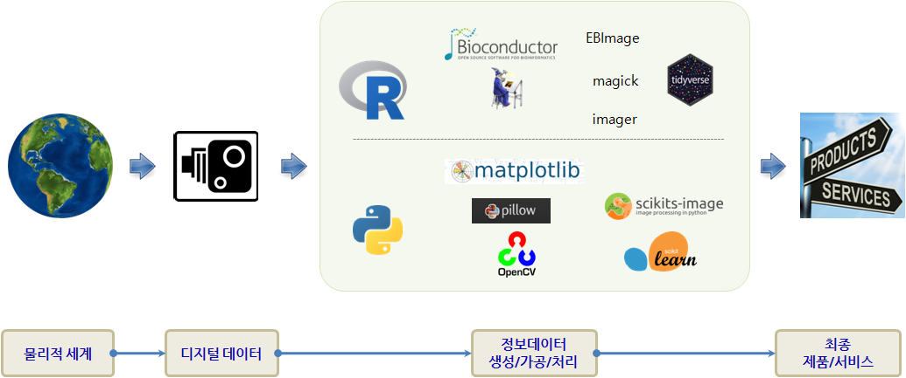

> ### 기계와의 경쟁을 준비하며... {.challenge}
> "The future is here, it's just not evenly distributed yet."  
>                                                           - William Gibson

물리적 세계를 다양한 카메라 기술을 사용해서 디지털 데이터로 변환을 한 후에 이를 최종상품 형태로 제공하기 전에
다양한 시각정보를 가공, 처리, 생성하는 과정을 거치게 된다. 만약 파이썬 언어로 이를 통합적으로 구성할 경우를 살펴보자.

고생대 참엽충의 전성기 재현하는데 사용되는 파이썬 팩키지는 다음과 같다. [^python-cv-lib]

[^python-cv-lib]: [My Top 9 Favorite Python Libraries for Building Image Search Engines](http://www.pyimagesearch.com/2014/01/12/my-top-9-favorite-python-libraries-for-building-image-search-engines/)

> ### 파이썬 컴퓨터 비전 도구 모음 {.getready}
> 
> * **맨손으로 시작**
>     * [Numpy](http://www.numpy.org/): 이미지는 결국 다차원 행렬로 행렬제어를 통해 이미지를 제어.
>     * [Scipy](http://scipy.org/): 결국, 거리를 측정하여 두개 이상의 이미지 유사성 일치도를 파악하고 분류하는데 필요.
> * **입출력**
>     * [matplotlib](http://matplotlib.org/)
> * **이미지 처리**    
>     * [Python Imaging Library(PIL)](https://en.wikipedia.org/wiki/Python_Imaging_Library): [Python Pillow](http://python-pillow.org/)는 [PIL](http://www.pythonware.com/products/pil/) 포크
> * **컴퓨터 비젼**
>     * [OpenCV](http://opencv.org/): 오픈 컴퓨터 비젼
>     * [SimpleCV](http://simplecv.org/): OpenCV를 쉽고 편하게.
>     * [Scikit-learn](http://scikit-learn.org/stable/): 파이썬 기계학습
>     * [mahotas](http://luispedro.org/software/mahotas): [생명정보 이미지](https:// en.wikipedia.org/wiki/Bioimage_informatics)
>     * [ilastik](http://www.ilastik.org/): interactive learning and segmentation toolkit

## 학습 목차

1. **준비 및 설치**
    1. [들어가며](cv-intro.html)
    1. [OpenCV 설치](opencv-install.html)
1. **컴퓨터 비젼 도구 없이 맨손으로** 
    1. [선형대수](basic-linear-algebra.html)
    1. [컴퓨터가 보는 이미지](image-files.html)    
1. **맛보기**
    1. [헬로 월드](cv-hello-world.html)
    1. [작업 파이프라인](cv-pipeline.html)    
        1. [이미지 파일 가져오기](cv-import.html)
        1. [이미지 파일 정보 살펴보기](cv-image-info.html)
    1. [OpenCV 맛보기](opencv-start.html)
    1. [이미지 조합](adding-images.html)

> ### xwMOOC 오픈 교재
> 
> - [컴퓨터 과학 언플러그드](http://unplugged.xwmooc.org)  
> - [리보그](http://reeborg.xwmooc.org)  
>      - [러플](http://rur-ple.xwmooc.org)  
> - [파이썬 거북이](http://swcarpentry.github.io/python-novice-turtles/index-kr.html)  
> - [정보과학을 위한 파이썬](http://python.xwmooc.org)  
> - [소프트웨어 카펜트리 5.3](http://swcarpentry.xwmooc.org)
> - [통계적 사고](http://think-stat.xwmooc.org/)
> - [IoT 오픈 하드웨어(라즈베리 파이)](http://raspberry-pi.xwmooc.org/)
>     - [$100 오픈 컴퓨터](http://computer.xwmooc.org/)   
>     - [$100 오픈 슈퍼컴퓨터](http://computers.xwmooc.org/)
> - [R 데이터과학](http://data-science.xwmooc.org/)
> - [R 팩키지](http://r-pkgs.xwmooc.org/)
> - [기호 수학(Symbolic Math)](http://sympy.xwmooc.org/)
> - [선거와 투표](http://politics.xwmooc.org/)
> - [기계학습](http://statkclee.github.io/ml)

[^David-Julian-2016]: [David Julian (2016), "Building Machine Learning Systems with Python", Packt Publishing](https://www.packtpub.com/big-data-and-business-intelligence/building-machine-learning-systems-python)