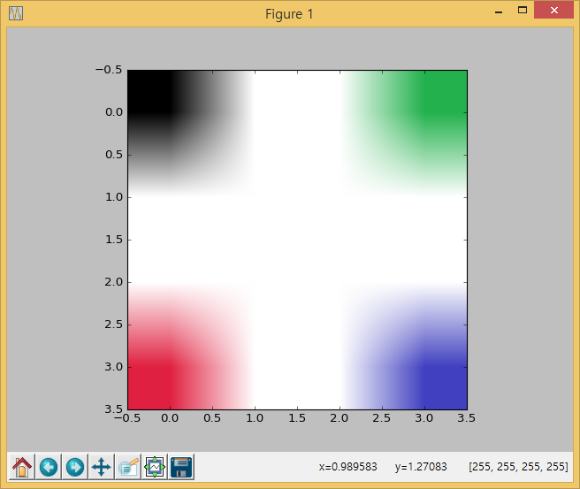

## 1. 이미지 불러오기

`PIL` 파이썬 이미지 라이브러리와 더불어 `numpy` 라이브러리를 가져온다.

이미지파일을 열어 파이썬 변수에 저장을 한다. 이때 `PIL` 라이브러리 `.open` 메쏘드를 사용한다.
그리고 나서, 이미지 객체를 `np.asarray` 메쏘드로 변환하고 화면에 출력한다.

~~~ {.python}
from PIL import Image
import numpy as np

img256Png = Image.open('../fig/color-256-dot.png')
img256PngArr = np.asarray(img256Png)

print img256PngArr
~~~

출력결과는 다음과 같다. 

~~~ {.python}
[[[  0   0   0 255]
  [255 255 255 255]
  [255 255 255 255]
  [ 34 177  76 255]]

 [[255 255 255 255]
  [255 255 255 255]
  [255 255 255 255]
  [255 255 255 255]]

 [[255 255 255 255]
  [255 255 255 255]
  [255 255 255 255]
  [255 255 255 255]]

 [[224  32  64 255]
  [255 255 255 255]
  [255 255 255 255]
  [ 64  64 192 255]]]
~~~

## 2. 이미지 작업하기

이미지 파일을 윈도우 그림판에서 불러온다. 작업할 그림은 [GitHub](https://raw.githubusercontent.com/statkclee/trilobite/gh-pages/fig/color-256-dot.png)에서 다운로드 받는다. 너무작아 눈에 잘 보이지 않을 수 있다. 화면 좌측 상단 끝에 위치하고 된다--스타크래프트 용어로 11시 방향 화면 끝이다.

윈도우즈 `그림판`을 최대한 확대하고 `도구` &rarr; `연필`을 선택한다.
검은색 점을 두개 찍는다.

그래픽 사용자 인터페이스(GUI)를 사용하여 바로 입력하고 결과를 확인하는 방법이 있다.

두번째 방법은 명령라인 인터페이스(CLI)를 사용해서 코딩으로 집어넣는 것이다.

~~~ {.python}
~~~

### 2.1. 작업 이미지 결과 살펴보기

운영체제에 별도 설치된 이미지 뷰어를 통해 이미지 파일을 살펴보는 것도 가능하지만, [matplotlib](http://matplotlib.org/)을 통해 코드 2줄로 작업된 결과를 바로 살펴보는 것도 가능하다.

`import matplotlib.pyplot as plt` 명령어를 통해서 `matplotlib` 라이브러리와서 `numpy` 객체를 입력받아 그래프로 출력한다. `plt.imshow(img256PngArr)`와 `plt.show()`를 순차적으로 입력한다.

~~~ {.python}
from PIL import Image
import numpy as np
import matplotlib.pyplot as plt

# 256 색상
img256Png = Image.open('../fig/color-256-dot.png')
img256PngArr = np.asarray(img256Png)

# 작업결과 뷰어로 바로보기
plt.imshow(img256PngArr)
plt.show()
~~~

## 3. 이미지 저장하기

`.fromarray()` 메쏘드를 통해서 이미지로 저장하고, `.save()` 메쏘드를 통해 최종적으로 
운영체제 이미지 파일로 떨꿔 저장한다.

~~~ {.python}
from PIL import Image
import numpy as np
import matplotlib.pyplot as plt

# 256 Color
img256Png = Image.open('../fig/color-256-dot.png')
img256PngArr = np.asarray(img256Png)

saveImage = Image.fromarray(img256PngArr.astype(np.uint8))
saveImage.save('dot.png')
~~~