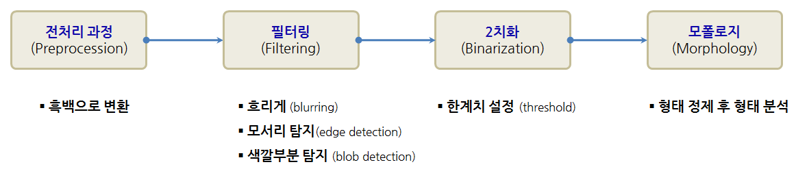
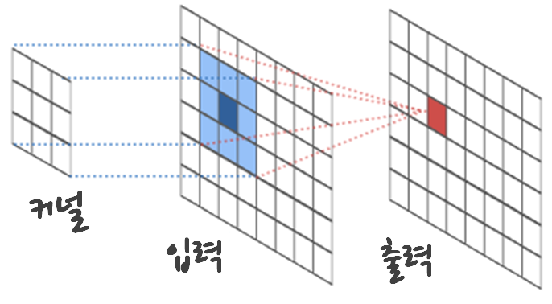

## 1. 파이썬 이미지 분석 작업 흐름 [^image-analysis-90]

[^image-analysis-90]: [Image Analysis in Python](https://github.com/brikeats/Image-Analysis-in-Python)

이미지 작업을 수행하는 방식은 원본 이미지를 전처리 과정으로 흑백(grayscale)으로 변환하는 것으로 시작한다. 
두번째 단계로 필터링을 통해 모서리와 색깔부분을 탐지하고 나서, 한계치를 설정해서 2치화를 수애하고 나서 모양을 정제 후 모양을 분석하는 순서로 순차적으로 진행된다.

> ### 파이썬 이미지 분석 라이브러리 {.callout}
>
> * 핵심 이미지 분석 라이브러리 
>     * Numpy: 수치데이터(행렬) 연산
>         * 일반 이미지(8비트, 0~255), 과학 이미지(16비트, 0~65535)
>         * C언어를 벡엔드 사용해서 빠르고, 구문은 Matlab 유사.
>     * Scipy: ndimage, 신호처리, 최적화
>     * Matplotlib: 기본 그래프 및 플롯팅
>         * 중요한 도식화함수: `imread`, `imsave`, `imshow`, `plot` 
>         * 주의: 좌표는 $(x,y)$로 표현되지만, 행렬은 $(행,열)$로 표현
>                즉, `imshow` `y`축에 원점이 상단에 위치하게 되어 `y` 축이 위와 아래가 뒤집힌다.
>     * Scikit-image: 잘 만든 이미지 분석 라이브러리 
> * 추가 유용한 소프트웨어 도구
>     * ipython: 파이썬 개발환경
>     * Scikit-learn: 범용 기계학습
>     * OpenCV: Scikit-image보다 사용법이 어렵지만 강력하고 실시간 응용프로그램에 적합
>     * ITK: 3D 분석, 주로 의료영상
>     * GIMP: 돈없는 사람을 위한 파이썬

## 2. 단계별 파이썬 이미지 분석 작업흐름 [^cv-book01][^cv-book02][^cv-book03]

### 2.1. 전처리 과정

전처리 과정으로 원본 이미지를 흑백으로 처리하는 것은 간단하다.

### 2.2. 필터링(Filtering)

필터링은 또다른 이미지를 생성하기 위해서 이미지에 처리작업을 가하는 것으로 정의된다.
기본적인 아이디어는 작은 정사각형, 이를 "커널(kernel)"이라고 부른다. 이 커널을 이미지 위에 쭉 이동시키는 것을 "합성곱(convolution)" 이라고 부른다. 빨간색 출력값을 계산하기 위해서 입력값을 커널과 곱하고 나서 합한다. 이를 합성곱으로 쭉이어 나가면 필터를 적용한 결과를 얻게 된다.

$$출력_{이미지} = 커널 \times 입력_{이미지}$$

* 흐리게(Blurring) 기능은 주변 픽셀을 평균하는 것을 의미한다. 적당히 흐리게 하면 잡음을 제거하는 효과가 크지만, 너무 많이 제거하게 되면 중요한 정보손실로 이어진다. 주변 픽셀에 모두 동일한 값을 주게되면 일양분포 필터가 되고, 2차원 가우스 정규분포를 적용하면 좀더 깔끔하게 처리된다.
* 기울기(Gradient)는 이미지 기울기(변화량) 측도로서, 만약 기울기가 크다면 이미지 모양의 모서리가 됨을 나타나게 된다. 수직기울기는 윗쪽 픽셀에서 아래쪽 픽셀을 빼면 되고, 수평기울기는 왼쪽에서 오른쪽으로 빼면 되고, 모든 방향에서 계산하는 소벨(Sobel) 필터를 통해 모서리를 추출한다.
* 특정 영역 픽셀이 주변 픽셀보다 밝다면 해당 영역을 "색깔영역(blob)"이라고 간주할 수 있다. 

### 2.3. 2치화(Binarization)

필터링을 거치게 되면 관심있는 영역은 더 밝아지고, 그외 지역은 더 어두워진 이미지가 산출된다. 적절한 한계값을 설정하고 적용하면, 한계값보다 큰 것은 흰색으로 설정되고, 어두운 픽셀은 검정색으로 설정된다. 한계값은 일반적으로 히스토그램을 그려서 모양을 보고 설정하게 된다.

### 2.4. 모폴로지(Morphology)

한계값을 설정하고 2치화 작업을 완료하게 되면 겉으로만 그럴싸한 작은 반점과 구멍이 많이 생기게 된다. 2치화된 이미지를 정제하는데 유용한 기능이 **모폴로지(Morphology)** 다. 

* 확장(Dilation): 흰색 물체를 더 크게 만듦.
* 침식(Erosion): 흰색 물체를 더 여위게 만듦.
* 구멍내기(Opening): 흰색 물체 사이 공간을 확장
* 구멍매우기(Closing): 검정 구명을 채움.

확장과 침식이 기본 모폴로지 연산자가 되고, 구멍내기와 구멍매우기는 확장과 침식연산을 조합한 것으로 볼 수 이따.

`scikit-image` 모폴로지와 측정 라이브러리에는 다음 기능이 포함되어 있다

* 물체에 표식하는 기능(Labeling)
* 물체 (추적을 위해) 중심점 계산
* 물체 면적 계산
* 아주 작은 물체 제거 기능 &rarr; 통상 잡음으로 간주됨.
* 물체 형태를 특징짓는 기능

[^cv-book01]: [E  Davies (2012), "Computer and Machine Vision: Theory, Algorithms, Practicalities", Academic Press](http://store.elsevier.com/Computer-and-Machine-Vision/E_-R_-Davies/isbn-9780123869081/)
[^cv-book02]: [Richard Szeliski (2010), "Computer Vision: Algorithms and Applications", Springer](http://szeliski.org/Book/)
[^cv-book03]: [Simon J.D. Prince (2012), "Computer Vision:  Models, Learning, and Inference", Cambridge University Press](http://www.computervisionmodels.com/)